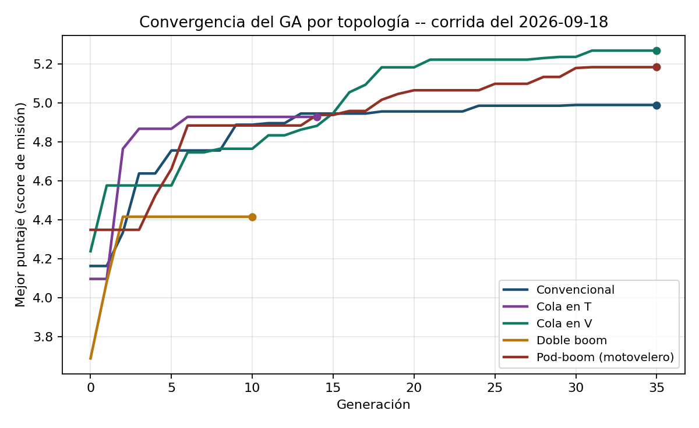
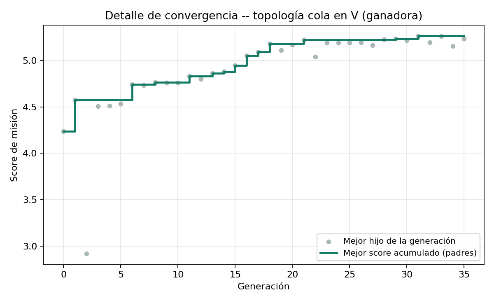

# Optimización multi-topología de un UAV de ala fija por algoritmo genético

Proyecto Final de Ingeniería Mecánica, ITBA — Felipe.

Este README es la versión Markdown del informe de arquitectura del proyecto (también disponible en LaTeX/PDF en [`documentos_de_decision/informe_desarrollo.pdf`](documentos_de_decision/informe_desarrollo.pdf) / [`.tex`](documentos_de_decision/informe_desarrollo.tex)): qué hace cada módulo del paquete `optimizacion_avion`, cómo se traducen los requisitos de vuelo y estabilidad en restricciones y términos de puntaje, por qué se tomaron las decisiones de parametrización (winglets, volumen mínimo de fuselaje, misión de tres puntos de vuelo), dónde se cambia cada parámetro, y los resultados de la última corrida de la competencia entre cinco topologías (18 de septiembre de 2026), con las curvas de convergencia del algoritmo genético.

## Tabla de contenidos

1. [La misión de diseño](#1-la-misión-de-diseño)
2. [Arquitectura del software](#2-arquitectura-del-software)
3. [De los requisitos de vuelo a las restricciones del código](#3-de-los-requisitos-de-vuelo-a-las-restricciones-del-código)
4. [Variables de diseño y dónde cambiarlas](#4-variables-de-diseño-y-dónde-cambiarlas)
5. [El algoritmo genético](#5-el-algoritmo-genético)
6. [Decisiones de diseño y su fundamento](#6-decisiones-de-diseño-y-su-fundamento)
7. [Resultados de la corrida del 18 de septiembre de 2026](#7-resultados-de-la-corrida-del-18-de-septiembre-de-2026)
8. [Qué queda fuera del modelo actual](#8-qué-queda-fuera-del-modelo-actual)
9. [Conclusiones](#9-conclusiones)
10. [Fuentes](#fuentes)

---

## 1. La misión de diseño

El problema es optimizar un UAV de ala fija con motor eléctrico, capaz de:

- volar en **crucero de diseño a 80 km/h** (22.2 m/s) con 3.0 kg de carga útil — éste es el punto donde se optimizan eficiencia aerodinámica, estabilidad estática y margen de ráfaga;
- alcanzar una **velocidad máxima de 120 km/h** (33.3 m/s), como requisito de reserva frente a viento y ráfagas — entra como restricción dura y como término adicional de puntaje, pero *ya no es el punto de diseño*;
- volar **lento, a 10 m/s**, para reconocimiento, despegue y aterrizaje, con margen del 20% sobre la velocidad de pérdida.

Estos tres puntos de vuelo compiten entre sí: crucero eficiente pide ala chica y perfiles de poco camber, vuelo lento pide ala grande y perfiles de alta sustentación (o flaps), y velocidad máxima pide baja resistencia de perfil a bajo $C_L$.

La misión bajó de crucero a 120 km/h a 80 km/h el 18/09/2026 tras un análisis de alcance con batería (ver [Research Note 15](<documentos_de_decision/Research Note 15 - Winglets, volumen de fuselaje y replanteo de la mision (2026-09-18).md>)): pedir 300 km de autonomía volando a 120 km/h exige cerca de 8.6 kg de batería sobre un avión de ~7 kg en seco, porque el alcance eléctrico R = Eη/D se maximiza a resistencia mínima, que para este avión cae cerca de 70–80 km/h y no a 120. El requisito de 120 km/h no se eliminó: se reclasificó como velocidad máxima.

## 2. Arquitectura del software

### 2.1 Mapa de módulos

| Módulo | Responsabilidad |
|---|---|
| `perfiles_avion.py` | Catálogo de 19 perfiles aerodinámicos (índices 0–11 = catálogo del ala volante, sin reordenar; 12–18 = perfiles nuevos de alta sustentación). Carga y mezcla perfiles reales de la base UIUC vía AeroSandbox, y modela el flap deflectando el contorno del perfil (no por tabla). |
| `geometria_avion.py` | Define las 5 topologías (`TOPOLOGIAS`), sus `BOUNDS` de diseño, construye la geometría 3D (`construir_avion`) como un `asb.Airplane`: ala de 5 estaciones con winglets, fuselaje con morro/boat-tail de forma libre, colas (convencional, T, V, doble boom). Calcula diagnósticos: volumen de cola, geometría del flap. |
| `estructura_avion.py` | Modelo de masa: larguero del ala dimensionado por flexión *y* rigidez sobre la distribución real de cuerdas, piel, winglets, mecanismo de flap, cola, fuselaje, vigas de boom. Resuelve por punto fijo la circularidad masa↔carga (`converger_masa_avion`). |
| `mision_avion.py` | El corazón del problema de optimización: evalúa los tres puntos de vuelo, las restricciones duras (estructura, volumen de fuselaje, vuelo a $V_{max}$, vuelo lento, estabilidad, ráfaga) y arma el puntaje escalar que ve el GA (`evaluar_mision_avion`). |
| `ga_numerico_avion.py` | Operadores genéticos: cruza BLX-α entre dos padres, mutación gaussiana, individuos *wildcard* (muestreo uniforme). Genera la lista de hijos de una generación. |
| `evolucion_avion.py` | Bucle evolutivo de *una* topología: mantiene el estado (2 padres elite, generación, racha sin mejora), corre generaciones, guarda/carga checkpoints, decide cuándo parar. |
| `competencia.py` | Orquesta la competencia entre las 5 topologías: corre cada una con su propia subpoblación (nunca se cruzan entre sí, ver §5.3), y compara los puntajes finales. Contiene las semillas (`SEEDS_POR_TOPOLOGIA`, cargadas de `semillas.json`). |
| `gen_semillas.py` | Script standalone que *genera* `semillas.json`: define una base de diseño razonable a mano por topología y afina numéricamente por bisección el CG (margen estático objetivo) y la incidencia de cola (trim). Se corre una sola vez por revisión de misión/geometría, no en cada optimización. |
| `__init__.py` | Re-exporta la API pública del paquete; es lo único que el notebook necesita importar. |

### 2.2 Flujo de datos

```
semillas.json  →  competencia.SEEDS_POR_TOPOLOGIA
      ↓
competencia.correr_competencia()  -- una vez por topología
      ↓
evolucion_avion.correr_evolucion_completa_avion()  -- bucle de generaciones
      ↓                                    ↑
ga_numerico_avion.generar_hijos_avion()    mision_avion.evaluar_mision_avion()
(propone geometrías)                       (las puntúa)
      ↓
geometria_avion.construir_avion() → estructura_avion.converger_masa_avion() → AeroSandbox
```

Un candidato es un diccionario de parámetros (`params`) más la topología a la que pertenece (`CandidateAvion`). `construir_avion(params, topologia)` arma el `asb.Airplane`; `converger_masa_avion` itera masa estructural → peso → sustentación requerida → carga estructural → masa estructural hasta converger (circularidad clásica de diseño preliminar); y `analizar_mision_avion` corre AeroSandbox (`AeroBuildup`) en los tres puntos de vuelo y arma el diccionario de resultados que consume tanto el puntaje como el reporte impreso (`desglose_mision_avion`).

## 3. De los requisitos de vuelo a las restricciones del código

### 3.1 Los tres puntos de vuelo

| Requisito | Constante | Cómo se aplica |
|---|---|---|
| Crucero de diseño, 80 km/h | `V_CRUCERO = 80/3.6` | Punto donde se calculan $C_L$, $C_D$, $L/D$, derivadas de estabilidad ($C_{m_\alpha}$, margen estático), trim ($C_{m,crucero}$) y respuesta a ráfaga. Domina el puntaje vía `PESO_EFICIENCIA=1.0` sobre $f_{ef} = D_{REF}/D_{crucero}$. |
| Velocidad máxima, 120 km/h | `V_MAX = 120/3.6` | Restricción dura: si el $C_L$ requerido en $V_{max}$ ≥ $C_{L,max}$ a ese Reynolds, el candidato se descarta (no se sostiene). Además puntúa con `PESO_VELMAX=0.5` sobre $f_{vm} = D_{REF\_VMAX}/D_{vmax}$ — la mitad del peso del crucero, porque es un requisito de reserva, no el régimen habitual de vuelo. |
| Vuelo lento, 10 m/s | `V_LENTO = 10.0` | Restricción dura: la velocidad de pérdida con flap desplegado tiene que ser < `V_LENTO`. Puntúa el margen *sobre* el objetivo (no solo el paso/no-paso) con `PESO_LENTO=1.0`, para que el optimizador no se quede pegado al borde de la restricción. |

### 3.2 Restricciones duras (descartan el candidato, no puntúan)

- **Estructura que no cierra**: `converger_masa_avion` no converge o da masa > 60 kg ⇒ `None`.
- **Volumen de fuselaje insuficiente**: $\eta_{vol} \cdot V_{geométrico} < V_{requerido}$ (ver §6.3).
- **No se sostiene a 120 km/h**, o no puede volar a 10 m/s ni con flap desplegado.
- **Margen estático negativo** ($SM = -dC_m/dC_L \leq 0$): el avión sería inestable en cabeceo.
- **$C_{n_\beta} \leq 0$ o $C_{l_\beta} \geq 0$**: inestabilidad direccional o lateral.
- **Entra en pérdida con la ráfaga de diseño** (3.0 m/s vertical) en crucero.

### 3.3 Puntaje (término suave, pondera candidatos válidos entre sí)

score = Σᵢ wᵢ·fᵢ, con fᵢ ∈ [0, ~1]:

| Término | Peso | Definición |
|---|---|---|
| Eficiencia en crucero | 1.0 | $f_{ef} = D_{REF}/D_{crucero}$ |
| Masa total | 0.3 | $f_{ma} = M_{REF}/M_{total}$ |
| Estabilidad (margen estático) | 1.5 | meseta suave dentro de la banda $[SM_{min}, SM_{max}]$ por topología |
| Ráfaga (suavidad) | 0.4 | meseta sobre el factor de carga incremental Δn |
| Margen de pérdida | 0.4 | $\min(1, margen/0.20)$ |
| Equilibrio en crucero (trim) | 0.3 | $\exp(-(C_{m,crucero}/0.02)^2)$ |
| Direccional ($C_{n_\beta}$) | 0.3 | $\min(1, C_{n_\beta}/0.0015)$ |
| Lateral ($C_{l_\beta}$) | 0.3 | $\min(1, -C_{l_\beta}/0.0015)$ |
| Vuelo lento | 1.0 | margen sobre el objetivo de velocidad de pérdida |
| Velocidad máxima | 0.5 | $f_{vm} = D_{REF\_VMAX}/D_{vmax}$ |

Los pesos de estabilidad (1.5) y vuelo lento (1.0) son los más altos a propósito: son requisitos de misión y de seguridad, no preferencias de eficiencia — si el optimizador pudiera "vender" estabilidad por un poco más de L/D, el diseño resultante no sería volable.

## 4. Variables de diseño y dónde cambiarlas

| Quiero cambiar... | Archivo | Dónde |
|---|---|---|
| Velocidad de crucero, máxima o de vuelo lento | `mision_avion.py` | `V_CRUCERO`, `V_MAX`, `V_LENTO` |
| Pesos del puntaje | `mision_avion.py` | bloque `PESO_*` |
| Volumen mínimo de fuselaje / factor de empaquetado | `mision_avion.py` | `VOLUMEN_UTIL_MIN_L`, `FACTOR_UTILIZACION_VOLUMEN` |
| Carga útil, masa de sistemas | `optimizacion_ala/estructura.py` | `MASA_PAYLOAD`, `MASA_SISTEMAS` (reutilizadas tal cual) |
| Rango de envergadura, cuerdas, torsión, diedro | `geometria_avion.py` | `BOUNDS_ALA` |
| Rango de winglets | `geometria_avion.py` | `BOUNDS_ALA["winglet_height"]` y afines |
| Rango de flaps | `geometria_avion.py` | `BOUNDS_FLAP` |
| Rango de fuselaje (largo, diámetro, morro, boat-tail) | `geometria_avion.py` | `BOUNDS_FUSELAJE` (y overrides por topología en `BOUNDS_DOBLE_BOOM`/`BOUNDS_POD_BOOM`) |
| Rango de cola (span, cuerda, flecha, incidencia) | `geometria_avion.py` | `_BOUNDS_COLA_HV`, `BOUNDS_V_TAIL`, `BOUNDS_DOBLE_BOOM` |
| Banda de margen estático aceptable | `geometria_avion.py` | `TOPOLOGIAS[topologia]["sm_band"]` |
| Agregar/quitar una topología | `geometria_avion.py` | diccionario `TOPOLOGIAS` + constructor de cola si hace falta |
| Catálogo de perfiles | `perfiles_avion.py` | `CATALOGO_AVION` (agregar SOLO al final, nunca reordenar) |
| Modelo de masa estructural | `estructura_avion.py` | `RHO_LARGUERO`, `SIGMA_ADM`, `MASA_AREAL_PIEL`, etc. (heredadas de `optimizacion_ala.estructura`) |
| Densidad lineal de vigas de boom | `estructura_avion.py` | `MASA_LINEAL_BOOM` |
| Penalización de masa de cola en T | `estructura_avion.py` | `FACTOR_MASA_T` |
| Semillas de partida (dos por topología) | `gen_semillas.py` | diccionarios `BASE`/`BASE_B` y `EXTRA`/`EXTRA_B`; correr el script después para regenerar `semillas.json` |
| Parámetros del GA (tamaño de camada, paciencia, generaciones) | `competencia.py` / llamada a `correr_competencia` | argumentos `n_crossbred`, `n_wildcard`, `paciencia`, `max_generaciones` |

> **Importante**: cualquier cambio en `BOUNDS_*` o en la misión (velocidades, restricción de volumen) puede volver inválidas las semillas actuales. El procedimiento correcto es correr `python -m optimizacion_avion.gen_semillas` para regenerar `semillas.json` *antes* de lanzar una competencia nueva — así se hizo el 18/09/2026 al bajar el crucero a 80 km/h y agregar la restricción de volumen.

## 5. El algoritmo genético

### 5.1 Operadores (`ga_numerico_avion.py`)

Cada generación produce hijos de dos tipos, a partir de los 2 padres elite actuales:

- **Cruza BLX-α** (n=7 por defecto): para cada parámetro, se muestrea uniformemente en $[\min(v_1,v_2) - \alpha d,\ \max(v_1,v_2) + \alpha d]$ con $d = |v_1-v_2|$ y α=0.5 — permite explorar más allá del segmento entre los dos padres, no solo interpolar. Después se aplica mutación gaussiana con probabilidad 0.3 y σ = 0.08(hi-lo).
- **Wildcards** (n=3 por defecto): muestreo uniforme independiente dentro de los `BOUNDS`, sin relación con los padres — inyectan diversidad y evitan que la población colapse prematuramente a un óptimo local.

### 5.2 Selección y estado (`evolucion_avion.py`)

Estrategia (μ+λ) con μ=2: los 2 padres y los n_crossbred+n_wildcard hijos compiten juntos, sobreviven los 2 mejores por puntaje. El criterio de parada (`deberia_parar`, reutilizado de `optimizacion_ala.evolucion`) corta si no hay mejora del mejor puntaje durante `paciencia` generaciones consecutivas, o al llegar a `max_generaciones`.

### 5.3 Por qué subpoblaciones separadas por topología

El puntaje de `evaluar_mision_avion` *sí* es comparable entre topologías (mismos términos, mismos pesos, misma misión), así que competir por el mejor puntaje final es válido. Lo que *no* es válido es cruzar por BLX-α un padre de cola en V con uno de doble boom: sus vectores de parámetros no tienen ni la misma forma (uno tiene `v_tail_span`, el otro `boom_largo`), así que "mezclarlos" no daría un diseño coherente de ninguna de las dos familias. `competencia.py` corre cada topología de punta a punta con su propia subpoblación, y compara los mejores puntajes finales al terminar — es una comparación de "quién llega más alto", no un cruzamiento entre familias.

## 6. Decisiones de diseño y su fundamento

### 6.1 Por qué estas cinco topologías (y no canard ni box-wing)

McGeer & Kroo [1] muestran que, a envergadura dada y con las restricciones de trimado y estabilidad impuestas, la configuración convencional con cola trasera está muy cerca del óptimo teórico, y ni el canard ni el tándem la superan salvo en casos marginales. No corresponde esperar que una topología exótica gane por una diferencia enorme — lo que separa a los candidatos es resistencia parásita, peso estructural y $C_{L,max}$.

No se incluyeron canard ni box-wing/joined-wing: el canard limita el $C_{L,max}$ utilizable del ala principal, que es justamente el recurso más escaso con el requisito de vuelo a 10 m/s; y el box-wing necesita una separación vertical h/b ~ 0.2 (aquí, ~0.5 m) para que aparezca el beneficio inducido de Prandtl, que a la escala de 7 kg de construcción artesanal se pierde frente a la resistencia parásita y la interferencia estructural de las uniones.

### 6.2 Winglets: por qué el optimizador los descartaba, y qué se hizo

Con la parametrización y la misión anteriores (crucero de diseño a 120 km/h), el GA eliminaba sistemáticamente los winglets. El motivo es físico, no un error:

- El arrastre inducido escala con $C_L^2$; a $C_L \approx 0.11$ (crucero a 120 km/h) el inducido es apenas ~3% del arrastre total, mientras que a $C_L \approx 1.2$ (vuelo lento) llega al 73%.
- Maughmer [2] formaliza la velocidad de cruce $V_{CR}$: por debajo de ella el ahorro de inducido supera la penalización de perfil del winglet, por encima ocurre lo contrario. Calculado numéricamente para este avión, $V_{CR} \approx 18.6$ m/s ($C_L \approx 0.35$) — muy por debajo del crucero anterior de 33.3 m/s.
- Scholz [3] mide que los winglets reales entregan en promedio solo ~36% del beneficio que daría una extensión de envergadura equivalente en momento flector de raíz; como acá la envergadura ya es libre, el optimizador tiene una palanca más barata para el mismo objetivo.
- Hepperle [4] señala que el winglet paga más cuando reemplaza una deriva vertical inexistente (ala volante); las topologías de este proyecto ya tienen cola vertical, así que el winglet no compra estabilidad direccional adicional.
- A los Reynolds de esta escala (2–7×10⁵) el winglet se degrada por separación laminar: Weierman [5] mide que la resistencia de perfil aproximadamente se duplica al partir el Reynolds a la mitad, y Nikolaou et al. [6] miden experimentalmente en un mini-UAV un winglet con +4.48% de $C_{L,max}$ pero también +1.29% de $C_{D,min}$.

**Decisión**: no forzar geometría de winglet. Se dejó `winglet_height` como variable libre en [0, 0.25] m (ya lo era) y se recalculó el trade-off bajando el crucero de diseño a 80 km/h, más cerca del cruce $V_{CR}$. El resultado de la corrida del 18/09 (§7) confirma que el trade-off cambió: tres de las cinco topologías eligen winglets no triviales, y dos los mantienen cerca de cero — es el optimizador resolviendo el compromiso, no una regla impuesta.

### 6.3 Volumen mínimo de fuselaje

Con las semillas anteriores, 7 de 10 no entraban el volumen de carga útil (payload + batería + aviónica) a una utilización de empaquetado razonable. Se agregó como restricción geométrica dura, siguiendo la formulación estándar de optimización multidisciplinaria de Hajdik, Adler & Martins [7]:

$$g(x) = V_{requerido} - \eta_{vol} \cdot V_{geométrico}(x) \leq 0$$

con $V_{requerido}=8.2$ L (anclado en 3.0 kg de payload a 0.5 kg/L, densidad de empaque declarada del UAV Penguin B [8], más ~0.5 L de batería y 1.67 L de aviónica estimados) y $\eta_{vol}=0.55$ como supuesto de ingeniería declarado (no hay valor publicado para UAV de esta escala en Roskam [9], Raymer o Torenbeek). $V_{geométrico}$ sale de `avion.fuselages[0].volume()`, siempre el fuselaje o góndola principal, nunca las vigas de cola. Ambas constantes están declaradas arriba de `mision_avion.py` para moverlas fácilmente en un análisis de sensibilidad.

Consecuencia sobre el espacio de diseño: `doble_boom` y `pod_boom` tienen fuselaje/góndola corto por diseño, así que se amplió su cota superior de `fuselaje_diametro` de 0.24 a 0.32 m — el volumen de un cuerpo de revolución crece con el cuadrado del radio, es la palanca más barata que tienen para no perder por empaquetamiento sin renunciar a la ventaja de arrastre de un fuselaje corto.

### 6.4 Modelo de flap sin tabla

El incremento de $C_{L,max}$ por flap no se toma de tabla (Raymer/Roskam: plain ~0.9) porque esas tablas están medidas a Reynolds de avión grande (10⁶–10⁷), y este UAV vuela lento a Re~2×10⁵. En su lugar se deflecta la geometría del perfil (`add_control_surface`) y se evalúa con NeuralFoil al Reynolds real del vuelo lento — el mismo modelo aerodinámico que el resto del pipeline. Medido así, un flap plain del 25% a 30° da ΔC_{L,max}~0.43–0.58, bastante por debajo del 0.9 de tabla, consistente cualitativamente con la degradación a bajo Reynolds reportada en ICAS 2010, paper 246 [10]. Limitación honesta: el método representa bien un flap *plain* (sin ranura); un flap ranurado o Fowler tiene física adicional que una deflexión de contorno no captura.

### 6.5 Catálogo de perfiles de alta sustentación

Se agregaron 7 perfiles de alta sustentación (naca4412, naca6412, sd7062, fx63137, e423, s1210, s1223) al final del catálogo existente, sin reordenar los 12 originales (reordenar cambiaría el significado de índices ya usados). El s1223, el de mayor $C_{L,max}$ del catálogo, está caracterizado específicamente para bajo Reynolds por Guglielmo & Selig [11].

## 7. Resultados de la corrida del 18 de septiembre de 2026

Corrida completa de las 5 topologías bajo la misión de tres puntos de vuelo (crucero 80 km/h, máxima 120 km/h, lento 10 m/s) y la restricción de volumen de fuselaje, con `paciencia=8`, `max_generaciones=35`. Tiempo total: 1030 s. Geometrías completas en [`optimizacion_avion/ganadores.json`](optimizacion_avion/ganadores.json).

### 7.1 Tabla comparativa

| Topología | Score | Gen. | L/D crucero | D crucero [N] | Masa [kg] | b [m] | winglet [m] |
|---|--:|--:|--:|--:|--:|--:|--:|
| **Cola en V** | **5.267** | 35 | 16.77 | 4.32 | 7.41 | 2.89 | 0.003 |
| Pod-boom (motovelero) | 5.182 | 35 | 16.53 | 4.28 | 7.30 | 3.03 | 0.009 |
| Convencional | 4.989 | 35 | 15.83 | 5.15 | 7.53 | 2.92 | 0.040 |
| Cola en T | 4.927 | 14 | 15.79 | 4.51 | 7.62 | 3.00 | 0.153 |
| Doble boom | 4.416 | 10 | 13.11 | 6.13 | 7.86 | 3.38 | 0.203 |

**Gana la topología cola en V**, con el mejor L/D de crucero (16.77) y el mejor margen estático (17.8%, dentro de la banda 10–20%). Le sigue de cerca el motovelero pod-boom (5.18), con masa total menor (7.30 kg) — son las dos configuraciones que McGeer & Kroo [1] predecirían cerca del óptimo, sin ganador aplastante. Doble boom queda última: su fuselaje corto, ahora obligado a ensancharse para cumplir el volumen mínimo, paga en resistencia parásita (D crucero 6.13 N, la peor de las cinco) más de lo que gana en brazo de cola.

Cola en T y doble boom pararon antes de las 35 generaciones por *paciencia agotada* (8 generaciones sin mejora): convergieron antes a su óptimo local dentro de esa subpoblación.

### 7.2 Winglets: el resultado que motivó el replanteo de la misión

Con el crucero de diseño ya en 80 km/h ($C_L \approx 0.25$–0.26, más cerca del cruce $V_{CR} \approx 0.35$), el resultado por topología es heterogéneo — ninguna regla impuesta, es el trade-off real resuelto caso por caso:

- **Doble boom (0.203 m) y cola en T (0.153 m)**: winglet sustancial, cerca o dentro del tercio superior del rango permitido.
- **Convencional (0.040 m)**: winglet chico pero no nulo.
- **Cola en V (0.003 m) y pod-boom (0.009 m)**: winglet efectivamente nulo (por debajo de `WINGLET_MIN_H`, se considera que no hay winglet).

Es un resultado plausible: las topologías que ganan más — V y pod-boom — ya tienen alta eficiencia por otras vías (menor masa, mejor forma en planta) y no necesitan el winglet; las que compiten peor en resistencia de perfil lo usan como recurso adicional.

### 7.3 Curvas de convergencia



*Mejor puntaje acumulado por generación, las cinco topologías. El punto final marca dónde se detuvo cada una (por paciencia agotada o por llegar a 35 generaciones).*

Las cinco curvas muestran el patrón esperado de un (μ+λ) elitista: progreso rápido en las primeras 5–10 generaciones (las semillas A/B, deliberadamente en extremos opuestos del compromiso ala grande/ala chica, dejan mucho margen de mejora por cruza), seguido de una meseta ruidosa con escalones ocasionales cuando un wildcard o una mutación grande encuentra una dirección nueva.



*Detalle de la topología ganadora (cola en V): puntos grises = mejor hijo de cada generación (ruidoso, refleja la exploración de BLX-α + wildcards); línea verde = mejor puntaje acumulado entre los padres (estrategia (μ+λ), nunca decrece). La brecha entre ambas curvas es la señal de que la exploración sigue aportando diversidad incluso cerca de la convergencia.*

### 7.4 Geometría y estabilidad del ganador (cola en V)

| | | | |
|---|--:|---|--:|
| Masa total | 7.41 kg | Margen estático (SM) | 17.8% (banda 10–20%) |
| Envergadura | 2.89 m | $C_{n_\beta}$ | 0.00193 /grado (>0) |
| Superficie | 0.911 m² | $C_{l_\beta}$ | −0.00318 /grado (<0) |
| Alargamiento (AR) | 9.16 | $V_H$ | 0.268 (ref. clase: 0.5–0.7) |
| Carga alar | 79.8 N/m² | $V_V$ | 0.0253 (ref. clase: 0.02–0.05) |
| $C_L$ crucero (80 km/h) | 0.264 | Velocidad de pérdida | 8.32 m/s (objetivo ≤8.33) |
| D a 120 km/h | 7.88 N | Volumen útil de fuselaje | 9.36 L (≥8.2 L requeridos) |

$V_H$ queda por debajo del rango de referencia de Scholz [12] — señal a revisar: puede indicar un horizontal (o el equivalente en V) algo chico para el brazo y la superficie que tiene, compensado en el margen estático por otra vía (posición del CG). No se impone como restricción porque el objetivo es que el optimizador dimensione la cola por sus consecuencias, no por una regla de manual, pero conviene señalarlo para revisión de diseño preliminar.

## 8. Qué queda fuera del modelo actual

- **Torsión y flameo del ala**: el criterio de rigidez en flexión frena el alargamiento, pero un ala esbelta puede ser inviable por torsión mucho antes, y este modelo no lo ve. Importa más ahora que la envergadura es libre.
- **Pandeo del recubrimiento.**
- **Masa de vigas de boom declarada**, no dimensionada por flexión (densidad lineal fija, `MASA_LINEAL_BOOM`); el diámetro de la viga ya es variable de diseño pero no se usa todavía para dimensionar su espesor de pared.
- **Potencia disponible real**: la restricción de $V_{max}$ es aerodinámica (¿el ala se sostiene?), no verifica que el motor/hélice elegido entregue la potencia que exige $D_{vmax} \cdot V_{max}$.
- **Factor de utilización volumétrica (0.55)**: supuesto de ingeniería declarado, no medido; conviene validarlo con un CAD real del compartimiento de carga.

## 9. Conclusiones

El paquete quedó estructurado en capas claras — geometría, estructura, misión, GA, competencia — con cada decisión de parametrización (envergadura libre, winglets, volumen de fuselaje, flap sin tabla, tres puntos de vuelo) trazable a una razón física o a una referencia bibliográfica, y con las constantes que definen la misión y las restricciones declaradas en un único lugar (`mision_avion.py`) para que sea fácil de auditar y de mover en un análisis de sensibilidad. La corrida del 18/09/2026 bajo la misión de tres puntos de vuelo da a la topología cola en V como ganadora, con un resultado de winglets heterogéneo por topología que confirma que la decisión de no forzarlos fue la correcta: el optimizador encuentra winglets donde ayudan y los descarta donde no, sin necesidad de una regla externa.

## Fuentes

1. McGeer, T., Kroo, I. (1983). "A Fundamental Comparison of Canard and Conventional Configurations." *Journal of Aircraft*, 20(11). https://ntrs.nasa.gov/citations/19840028263
2. Maughmer, M. D. (2003). "The Design of Winglets for Low-Speed Aircraft." *Technical Soaring* / AIAA.
3. Scholz, D. (2018). "On the Aerodynamic Efficiency of Winglets." DGLR.
4. Hepperle, M. (DLR). "Aerodynamic Design of Winglets." https://www.mh-aerotools.de/
5. Weierman, R. (2010). "Winglet Design and Optimization for UAVs." MS Thesis, Wichita State University.
6. Nikolaou, N. et al. (2025). Estudio experimental de winglets en un mini-UAV, Re≈3.86×10⁵.
7. Hajdik, H., Adler, E., Martins, J. R. R. A. (2023). "Physics-Based Aerostructural Optimization of Conventional and Strut-Braced Wing Aircraft." AIAA 2023-3589.
8. UAV Factory. Especificación pública del UAV Penguin B (densidad de empaque payload/volumen de bahía).
9. Roskam, J. *Airplane Design*, Parts I–VI.
10. ICAS 2010, paper 246: NACA 2412 con flap del 30%c a Re 61k–260k.
11. Guglielmo, J. J., Selig, M. S. (1997). "High-Lift Low Reynolds Number Airfoil Design." *Journal of Aircraft*, 34(1). https://m-selig.ae.illinois.edu/pubs/GuglielmoSelig-1997-JofAC-S1223.pdf
12. Scholz, D. (2021). "Tail Volume Coefficients." *INCAS Bulletin*, 13(3). https://www.fzt.haw-hamburg.de/pers/Scholz/Aero/AERO_PUB_INCAS_TailVolume_Vol13No3_2021.pdf
13. Zahm, A. F., Smith, R. H., Louden, F. A. (1928). NACA Report 291: fineness ratio óptimo de fuselaje.

---

*Ver también: [Research Note 15](<documentos_de_decision/Research Note 15 - Winglets, volumen de fuselaje y replanteo de la mision (2026-09-18).md>) (winglets, volumen de fuselaje, alcance con batería) y el resto de `documentos_de_decision/` para las notas de decisión anteriores del proyecto.*
