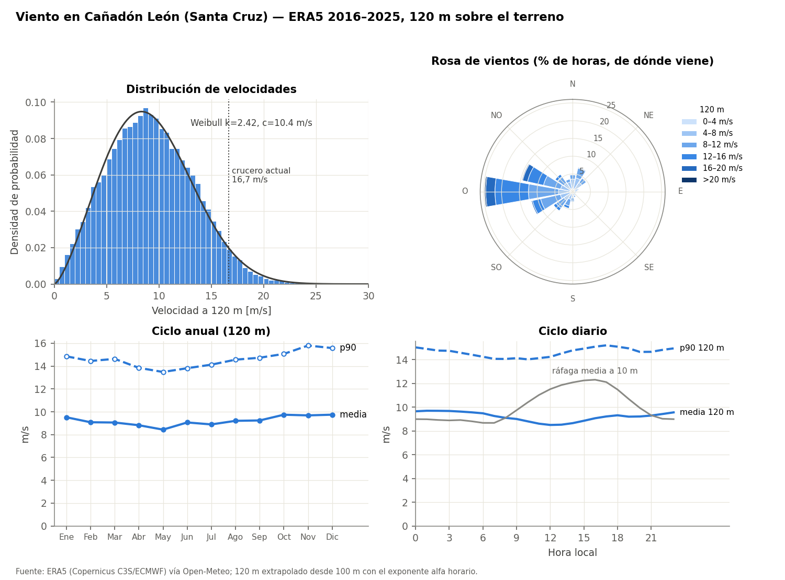
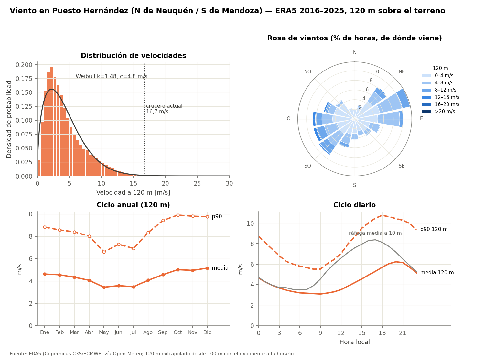
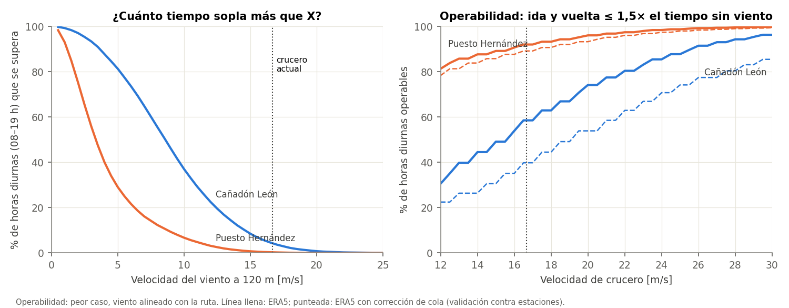
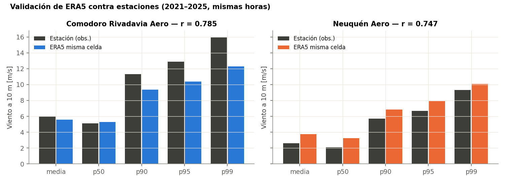

# Datos de viento: Cañadón León y Puesto Hernández

*Relevado el 30/09/2026. Carpeta pensada para que el código de VLM o de misión lea directamente las fichas `.yaml`, y para que la tesis cite de dónde sale cada número.*

## 1. Qué hay en esta carpeta

```
Datos de viento/
├── LEEME.md                        ← este archivo (resultados, supuestos, fuentes)
├── fichas/
│   ├── canadon_leon.yaml           ← parámetros listos para el código
│   └── puesto_hernandez.yaml
├── tablas/                         ← CSV para Excel o la tesis
│   ├── <sitio>_mensual.csv         (media/p90/p95 por mes, ráfagas, alfa)
│   ├── <sitio>_diurno.csv          (lo mismo por hora del día)
│   ├── <sitio>_rosa_120m.csv       (16 sectores × clases de velocidad)
│   ├── <sitio>_excedencia.csv      (% de horas que se supera cada velocidad)
│   └── operabilidad.csv            (% de horas volables vs velocidad de crucero)
├── figuras/                        ← PNG para la tesis
├── datos/                          ← resúmenes estadísticos completos (JSON) + validación
├── scripts/
│   ├── descargar_era5.py           ← baja la serie horaria completa y rehace los resúmenes
│   └── procesar_viento.py          ← genera fichas, tablas y figuras a partir de datos/
├── codigo_viento/                  ← implementación: paquete viento_uav, tests y evaluación de los ganadores
├── optimizar_con_viento.py         ← corre la competencia de topologías CON viento y la compara con la del 18/09
├── resultados_optimizacion/        ← tabla y gráficos de esa comparación
└── caracterizacion_viento.pdf/.tex ← informe completo
```

La serie horaria completa (87 672 horas por sitio) **no está incluida**, pero se baja con un comando:
`python scripts/descargar_era5.py`. El script crea `datos_crudos/` con un CSV por sitio y recalcula los resúmenes con exactamente la misma lógica. Esa lógica se verificó contra el cálculo original y da resultados idénticos.

## 2. Resultados principales

Todos los valores son a **120 m sobre el terreno** (altura máxima típica de operación), con datos de 2016 a 2025 salvo que se indique otra cosa.

| | **Cañadón León** (Santa Cruz) | **Puesto Hernández** (Neuquén/Mendoza) |
|---|---|---|
| Viento medio | 9.2 m/s (33 km/h) | 4.3 m/s (16 km/h) |
| p90 / p95 / p99 | 14.6 / 16.1 / 19.1 m/s | 8.7 / 10.5 / 13.6 m/s |
| p95 solo de día (08–19 h) | 16.3 m/s | 10.9 m/s |
| Dirección dominante | Oeste–ONO (≈40 % de las horas, los más fuertes) | Más repartido: ENE–E (22 %) y SO–O (27 %) |
| Estacionalidad | Parejo todo el año; algo más en primavera y verano | Claramente más ventoso de septiembre a enero; calmo de mayo a julio |
| Ciclo diario | Casi plano a 120 m; en superficie sopla más a la tarde | Mínimo a la mañana (3 m/s), máximo a las 20 h (6 m/s) |
| Ráfaga a 10 m: p99 / máx. | 22.1 / 36.0 m/s | 17.3 / 28.7 m/s |
| Exponente de corte α (mediana) | 0.18 (0.11 de día, 0.22 de noche) | 0.13 (0.10 de día, 0.25 de noche) |
| Densidad del aire: media / diseño* | 1.21 / 1.14 kg/m³ | 1.13 / 1.06 kg/m³ |
| Turbulencia (Dryden) del sitio | **moderada** (W20 ≈ 29 kt) | entre ligera y moderada (W20 ≈ 19 kt) |
| Weibull (k, c) | 2.42, 10.4 m/s | 1.48, 4.8 m/s |

\* Densidad de diseño = p05 de superficie × 0.986 (corrección por los 120 m). Es la condición de aire "fino", la peor para sustentar.

**Los dos sitios son muy distintos.** En Cañadón León sopla el viento patagónico del oeste, fuerte y casi constante. Puesto Hernández, en cambio, está en una zona mucho más calma, con un ciclo diario marcado. Además, Puesto Hernández está a unos 670 m de altura, así que el aire es alrededor de un 6 % menos denso.




## 3. Qué implica para el diseño actual (repositorio `genetic_wing`, misión del 18/09)

El optimizador actual (`optimizacion_avion`) compite 5 topologías con crucero de diseño a **80 km/h**, velocidad máxima de **120 km/h** y vuelo lento a 10 m/s. Lo que sigue es la evaluación de esos diseños con el viento de los sitios. Se hizo con el código de `codigo_viento/` (sección 4). Desde el 2026-10-02 el viento además **entra en la optimización** (`VIENTO_ACTIVO` en `optimizacion_avion/mision_avion.py`): ver la Research Note 16 en `documentos_de_decision/`.

**a) Velocidad de crucero y operabilidad.** El peor caso es el viento soplando a lo largo de la ruta. En ese caso, el tiempo de ida y vuelta se multiplica por 1/(1 − (W/V)²).

| Velocidad respecto del aire | Cañadón León: % de horas diurnas con ida+vuelta ≤ 1.5× | ...con corrección de cola | Puesto Hernández |
|---|---|---|---|
| 60 km/h (misión original) | 58 % | 40 % | 92 % |
| **80 km/h (crucero actual)** | **80 %** | **63 %** | **97 %** |
| 90 km/h | 88 % | 74 % | 99 % |
| **120 km/h (V_max)** | 99 % | 92 % | 100 % |

Al pasar el crucero de 60 a 80 km/h, el problema de Cañadón León se achicó mucho. Las horas sin avance bajaron del 5–17 % al 1–3 %. Además, los 120 km/h de reserva alcanzan para volver incluso con los vientos más fuertes. Con esto, el requisito de V_max que se había puesto "frente a viento y ráfagas" queda respaldado con datos.



**b) Ráfaga.** El optimizador usa 3 m/s, que coincide con **2σ de turbulencia moderada** (3.1 m/s). Es un buen criterio de operación o suavidad. Como ráfaga de diseño propongo **3σ ≈ 4.6 m/s**. Con los ganadores actuales (Kg ≈ 0.50 a 80 km/h):
- **ningún diseño entra en pérdida**: el margen va del 18 % al 41 %;
- el **factor de carga** queda en n ≈ 3.1–3.4 a 80 km/h, y llega a n ≈ 4.2–4.6 si la misma ráfaga ocurre a 120 km/h.

**c) Estructura.** `estructura.py` dimensiona con `N_LIMITE = 3.0` (`N_ULTIMO = 4.5`). La ráfaga de diseño a 80 km/h y la ráfaga de operación a 120 km/h quedan **levemente por encima** de ese límite, y la ráfaga de diseño a 120 km/h llega al borde del último. Es una decisión del grupo, con dos caminos:
- subir `N_LIMITE`;
- adoptar, como CS-23, una ráfaga menor a velocidad máxima y limitar la velocidad en aire turbulento.

El momento flector en la raíz con ráfaga es de 3 a 5 veces el de vuelo a 1 g; el detalle está en `codigo_viento/resultados/`.

**d) Densidad y constantes de viento.** El optimizador usa ρ = 1.225 kg/m³ y viento de Neuquén Aeropuerto (media de 3.1 m/s). En los sitios, el CL de crucero real es entre un 7 % (Cañadón León) y un 16 % (Puesto Hernández) mayor. Desde el 2026-10-02 la densidad y la ráfaga del sitio ya entran en el puntaje del optimizador (`optimizacion_avion/viento.py`, Research Note 16). Resultado: el optimizador agranda el ala para recuperar el vuelo lento, y la cola en V sigue ganando.

Sobre la ráfaga de CS-23/FAR-23 (15.24 m/s a V_C): en un avión de unos 22 m/s implica Δα ≈ 19°, es decir, entrada en pérdida segura. Por eso no se usa como ráfaga de diseño.

## 4. Cómo entra en el código: `codigo_viento/`

La investigación está implementada en un paquete de Python, `viento_uav`, que es **independiente del optimizador**. El detalle está en `codigo_viento/LEEME.md`.

```python
import viento_uav as vu
f = vu.cargar_ficha("canadon_leon")
f.rho_diseno, f.U_ds("diseno"), f.dryden(120)              # 1.14 kg/m3, 4.63 m/s, sigmas y escalas
vu.operabilidad(f, V=80/3.6, corregido=True)               # 63 % de horas diurnas
vu.chequeo_rafaga_desde_analisis(analisis, f)              # n, Kg, margen de pérdida (dict de ganadores.json)

from viento_uav import vlm_viento as vv                    # VLM con viento sobre cualquier asb.Airplane
campo = vu.RafagaCoseno(U_ds=4.63, H=10) + vu.TurbulenciaDryden.desde_ficha(f, 120)
vv.barrido_H(avion, 22.2, f.rho_diseno, W, 4.63, [2, 4, 10, 20, 40])   # ráfaga crítica, n y momento en la raíz
```

- **Ráfaga discreta 1−coseno:** el avión la atraviesa con libertad de subir y con el retardo de la sustentación (Küssner/Wagner). Esta respuesta dinámica reproduce el factor Kg de FAR 23.341 con un error de alrededor del 3 %. Las ráfagas críticas son las cortas, de 6 a 12 cuerdas.
- **Gradiente vertical** (despegue y aterrizaje): el campo `CortanteVertical` usa el α de la ficha. De día α ≈ 0.10; α ≈ 0.25 es el caso de aire estable.
- **Turbulencia continua (Dryden):** se sintetiza a partir de los espectros, con las σ y escalas L de la ficha.
- **Viento medio:** no entra al VLM; se usa para la misión (operabilidad, alcance).

El informe completo, con la metodología, los resultados y la implementación, está en `caracterizacion_viento.pdf`.

## 5. Metodología y supuestos

**Fuente principal: ERA5**, el reanálisis horario del ECMWF para Copernicus. Tiene una grilla de 0.25° (unos 28 × 19 km a esas latitudes). Se accedió a través de la API histórica de Open-Meteo, con el modelo `era5`, para 2016–2025 completo, sin horas faltantes. Se usaron el viento a 10 y 100 m, la dirección, la ráfaga a 10 m, la temperatura a 2 m y la presión en superficie.

**Puntos usados:**
- Cañadón León: −46.56, −67.62, junto a Cañadón Seco. El yacimiento está en el noreste de Santa Cruz, en la Cuenca del Golfo San Jorge.
- Puesto Hernández: −37.27, −69.08, unos 20 km al noroeste de Rincón de los Sauces, dentro del área de concesión que abarca Neuquén y Mendoza. En el informe figura como "PIPH"; conviene confirmar la sigla con Quintana.
- Las coordenadas son representativas, no la de cada pozo. Las celdas vecinas (±0.25°) dan valores parecidos: en Cañadón León el viento medio a 100 m varía entre 8.5 y 9.0 m/s, y en Puesto Hernández entre 3.6 y 4.8 m/s (ver `datos/sensibilidad_espacial_era5.json`). Para rutas de 60–70 km, un punto por sitio alcanza.

**Viento a 120 m:** se extrapoló desde 100 m con el α de cada hora: V₁₂₀ = V₁₀₀·1.2^α, con α = ln(V₁₀₀/V₁₀)/ln(10), acotado entre −0.1 y 0.6. Es una extrapolación corta, del orden del 3 %.

**Validación contra estaciones reales** (NOAA NCEI Global Hourly, reportes SYNOP y METAR, 2021–2025, unas 40 000 horas emparejadas por estación):

| Estación | Media obs. / ERA5 | p90 obs. / ERA5 | p99 obs. / ERA5 | Correlación |
|---|---|---|---|---|
| Comodoro Rivadavia Aero (referencia para Cañadón León) | 5.97 / 5.58 | 11.3 / 9.3 | 16.0 / 12.3 | 0.79 |
| Neuquén Aero (referencia para Puesto Hernández) | 2.61 / 3.75 | 5.7 / 6.9 | 9.3 / 10.1 | 0.75 |

- **En la Patagonia, ERA5 subestima los vientos fuertes** entre un 20 y un 30 % en la cola. Por eso se recomienda un **factor de cola de 1.25 para Cañadón León**, aplicado a p90 y valores más altos y a los extremos. La columna "con corrección de cola" de la tabla de operabilidad lo usa.
- En Neuquén, ERA5 sobreestima la media, porque la estación está en un valle reparado, pero acierta en el p99. Las ráfagas máximas observadas son alrededor de un 10 % mayores. Por eso se usa un factor de 1.10 para Puesto Hernández.
- Ninguna estación coincide con los sitios, así que estos factores son una estimación razonable, no una corrección exacta. Si Quintana u YPF tienen una estación meteorológica en el yacimiento, o datos del parque eólico Cañadón León (YPF Luz), esos datos le ganan a todo esto.



**Turbulencia:** se usó el modelo de Dryden de baja altura (h < 1000 ft): σ_w = 0.1·W20, σ_u = σ_w/(0.177 + 0.000823h)^0.4, con L_w = h y L_u = h/(0.177 + 0.000823h)^1.2 (h en pies). Los niveles son W20 = 15, 30 y 45 kt para turbulencia ligera, moderada y severa. W20 es el viento a 20 ft (6 m). Para cada sitio se estimó como el p99 del viento a 10 m, corregido por el factor de cola y llevado a 6 m. Un chequeo independiente con teoría de capa límite (u* = 0.4·U₁₀/ln(10/z₀), σ_w ≈ 1.25·u*, z₀ = 0.03 m para estepa) da σ_w = 1.42 m/s en Cañadón León, frente a 1.54 m/s de Dryden moderada: son coherentes. Para Puesto Hernández da 0.90 m/s, entre ligera (0.77) y moderada. **Se recomienda diseñar con turbulencia moderada** como envolvente única para los dos sitios.

**Ráfaga discreta:** se propone U_ds = 3σ_w de la turbulencia de diseño, porque las normas tripuladas no están pensadas para un UAV de 17 m/s. **Este criterio es una propuesta nuestra y hay que justificarlo en la tesis.** El alivio de ráfaga Kg = 0.88μ/(5.3 + μ) es el de FAR 23.341, que ya usa el código.

**Extremos en tierra:** se ajustó una distribución de Gumbel a los 10 máximos anuales de ráfaga. Da unos 34 m/s cada 10 años en Cañadón León y unos 28 m/s en Puesto Hernández, antes de la corrección de cola. Sirve para el anclaje y la estiba del UAV en tierra, no para el vuelo.

## 6. Limitaciones

- ERA5 representa el promedio de una celda de unos 25 km. No ve efectos locales (bardas, cañadones, la estela de un aerogenerador) ni la turbulencia de pequeña escala: por eso la turbulencia sale de normas y no del reanálisis.
- Diez años de datos alcanzan para la climatología, pero son pocos para extremos de 50 años.
- La densidad se calculó para aire seco. El error por humedad es menor al 1 %.
- La operabilidad supone el peor caso: viento alineado con la ruta y potencia constante. Con viento cruzado o rutas que no son de ida y vuelta, el resultado es mejor.

## 7. Fuentes

- ERA5: Hersbach, H. et al. (2020), *The ERA5 global reanalysis*, Q. J. R. Meteorol. Soc. 146, 1999–2049. Copernicus Climate Change Service.
- [Open-Meteo Historical Weather API](https://open-meteo.com/en/docs/historical-weather-api): la URL exacta de cada consulta está en cada ficha (`fuente_principal.url_consulta`).
- [NOAA NCEI Global Hourly (ISD)](https://www.ncei.noaa.gov/access/services/data/v1?dataset=global-hourly): estaciones 87860099999 (Comodoro Rivadavia) y 87715099999 (Neuquén).
- [MathWorks, Dryden Wind Turbulence Model (Continuous)](https://www.mathworks.com/help/aeroblks/drydenwindturbulencemodelcontinuous.html): resume las formulaciones de MIL-F-8785C y MIL-HDBK-1797.
- [14 CFR §23.333, envolvente de ráfaga](https://www.govinfo.gov/content/pkg/CFR-2011-title14-vol1/pdf/CFR-2011-title14-vol1-sec23-333.pdf) y [§23.341, factores de carga por ráfaga](https://www.govinfo.gov/content/pkg/CFR-2011-title14-vol1/pdf/CFR-2011-title14-vol1-sec23-337.pdf).
- [NATO STANAG 4671](https://en.wikipedia.org/wiki/NATO_STANAG_4671): la norma de aeronavegabilidad de UAV, basada en CS-23, que cubre UAV de 150 kg a 20 000 kg. Nuestro UAV queda fuera de su rango, así que se cita solo como referencia.
- Ubicación de Cañadón León: [Pérez, IAPG Conexplo 2018](https://biblioteca.iapg.org.ar/ArchivosAdjuntos/Conexplor2018/SEF/1250.pdf) y [estudio del parque eólico Cañadón León](https://openlandcontracts.org/contract/ocds-591adf-7422492505/download/pdf).
- Ubicación de Puesto Hernández: [Groba et al., IAPG](https://biblioteca.iapg.org.ar/ArchivosAdjuntos/CONAID2/051trabajo.pdf) y [YPF, hecho relevante 31/01/2014](https://edicion.ypf.com/inversoresaccionistas/Lists/HechosRelevantes/31-01-2014%20BCBA%20%20Puesto%20Hernández.pdf).

## 8. Cómo regenerar o agregar un sitio

1. En `scripts/descargar_era5.py`, agregar el sitio con sus coordenadas en `SITIOS`.
2. En `scripts/procesar_viento.py`, agregarlo en `SITIOS` con su color, factor de cola y estación de referencia.
3. Ejecutar `python scripts/descargar_era5.py` y después `python scripts/procesar_viento.py`.

Requisitos: `pip install requests numpy scipy matplotlib pyyaml`.
